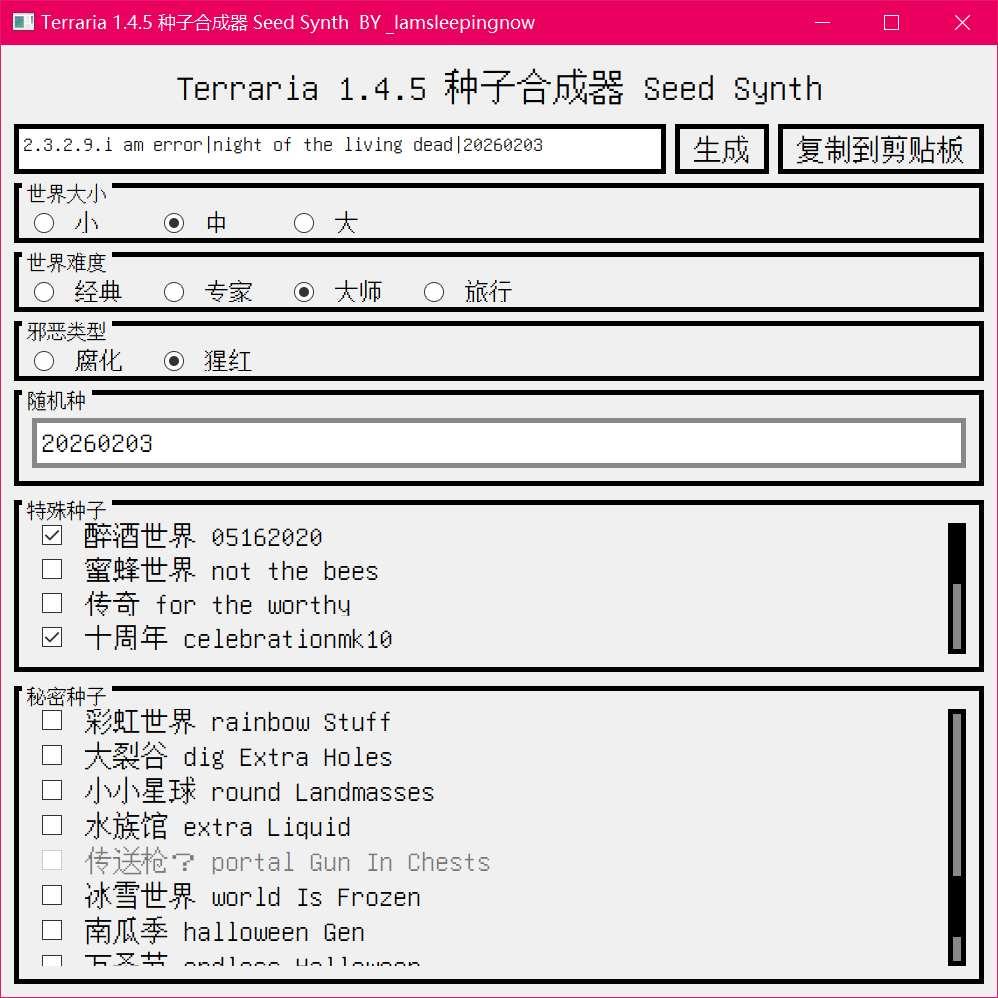

# 泰拉瑞亚1.4.5种子合成器 Terraria Seed Synth

- 此脚本用于生成泰拉瑞亚PC端1.4.5版本的融合种子。
- 测试Python版本：3.10.10。
- 我没有将`/UI`路径上传，因为里面有一个`unifont.ttf`字体文件，该文件不支持MIT协议，但可以去`https://www.maoken.com/freefonts/3747.html`自行下载。

## 构建方法

- 在合适的路径中打开 Powershell
- 先将工程拉到本地：`git clone https://github.com/Iamsleepingnow/Terraria1.4.5_Seed_Synth.git`
- 进入工程路径：`cd Terraria1.4.5_Seed_Synth`
- 然后构建Python虚拟环境：`python -m venv ./venv/`
- 激活该环境，安装模块：`./venv/Scripts/activate` -> `python -m pip install -r requirements.txt`
- 在该环境中运行py脚本：`python Terraria145SeedSynth.py`

## 打包

- 可以使用Pyinstaller来打包：
  - 使用之前的方法进入工程中的Python虚拟环境
  - 使用`python -m pip install pyinstaller`来安装一下pyinstaller
  - 对py脚本进行打包：`pyinstaller -F --noconsole -n <程序名称> -i ./UI/Icon.ico Terraria145SeedSynth.py`
  - 当Powershell提示`INFO: Build complete!`后，将`./dist/`中的exe执行文件、`./UI`文件夹放在同一路径中即可完成打包

